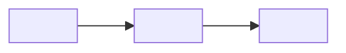
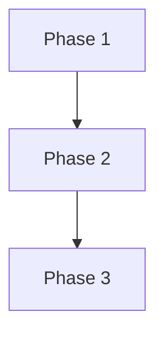

# Plan: <feature name>

**Feature slug:** <feature_slug>
**Source spec:** <relative path to spec.md>
**Author:** <named human>
**Date:** <YYYY-MM-DD>
**Status:** Draft | In review | Approved

---

## 1. Summary

One paragraph. What we are building, in what shape, and roughly in what order.

## 2. Architecture summary

Prose describing how this feature fits the existing system. Name the components, services,
stores, and external integrations touched. Include at least one Mermaid diagram.

## 3. Phases

Each phase ends at a demonstrable state. Each phase lists inputs, deliverables, exit
criteria, and the requirement IDs satisfied.

### Phase 1 — <name>

- **Inputs:** <bullet>
- **Deliverables:** <bullet>
- **Exit criteria:** <bullet — testable>
- **Requirement IDs satisfied:** R-<#>, R-<#>

### Phase 2 — <name>

- **Inputs:** <bullet>
- **Deliverables:** <bullet>
- **Exit criteria:** <bullet — testable>
- **Requirement IDs satisfied:** R-<#>

### Phase 3 — <name>

- **Inputs:** <bullet>
- **Deliverables:** <bullet>
- **Exit criteria:** <bullet — testable>
- **Requirement IDs satisfied:** R-<#>

## 4. Dependency graph

## 5. Estimates

| Phase | T-shirt | Day range | Notes |
|---|---|---|---|
| 1 | S | 1–2 | — |
| 2 | M | 3–5 | — |
| 3 | L | 5–8 | split candidate |

## 6. Parallelisation notes

- Which phases can overlap: <bullet>
- Expected file hot-spots (watch for merge conflicts): <bullet>
- Shared schema or data migration contention: <bullet>

## 7. Risks and mitigations

| Risk | Likelihood | Impact | Mitigation | Owner role |
|---|---|---|---|---|
| <risk> | L/M/H | L/M/H | <mitigation> | <role> |

## 8. References

- Project constitution: [`.agent/constitution.md`](../../.agent/constitution.md)
- Spec: <path>
- PRD: <path>
- Related plans: <paths>

### Lore citations

Include every binding lore entry that applies to this feature. Use the `lore-reader` citation
format:

- `[LORE-<id>] <title> — <one-line takeaway>` (status=<status>, source=<path>)
- `[LORE-<id>] <title> — <one-line takeaway>` (status=<status>, source=<path>)

---

*Generated from the Morpheus `feature-template/plan.md.tmpl` template.*
